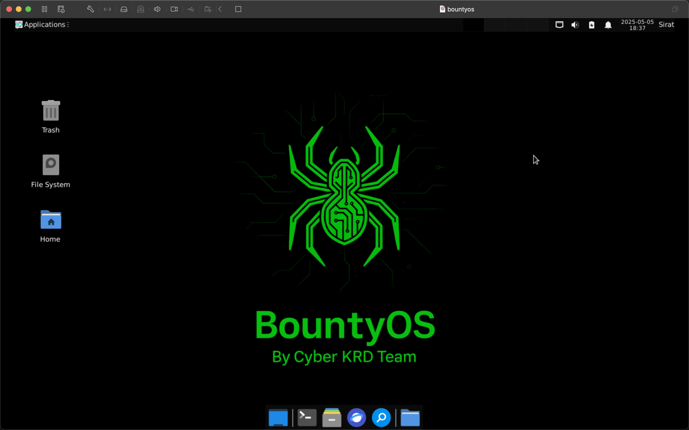

# 🕷️ BountyOS

Welcome to **BountyOS** – a sleek, hacker-style Linux OS crafted specifically for **bug bounty hunters**, **penetration testers**, and **cybersecurity researchers**.

> _"Built by hackers, for hackers."_  

---

## 🚀 About

**BountyOS** is a Debian-based live system focused on offensive security, offering a curated suite of tools for reconnaissance, scanning, exploitation, and post-exploitation.  
It strips away the noise and gives you exactly what you need — no fluff, just raw power.

---

## 🛠️ Preinstalled Tools

BountyOS includes **78 essential tools** that every bug bounty hunter should have in their arsenal.  
Here’s a quick peek at some of them:

| Tool       | Description |
|------------|-------------|
| `nmap`     | Network discovery and port scanning |
| `ffuf`     | Fast web fuzzer for URL discovery |
| `amass`    | Subdomain enumeration |
| `httpx`    | Probing tool for HTTP-based services |
| `burpsuite`| Web vulnerability testing suite |
| `sqlmap`   | Automatic SQL injection detection and exploitation |
| `masscan`  | High-speed port scanner |
| `gobuster` | Directory and DNS brute-forcing |
| `subfinder`| Passive subdomain enumeration |
| `dnsx`     | Fast and customizable DNS toolkit |
| ...and 66 more! 🔥 |

▶️ Tools will be added continuously, View the full list of tools: [tools.html](tools.html)

---

## 📦 System Requirements

- 🧠 **RAM:** 4 GB minimum (4 GB+ recommended)  
- 💽 **Disk:** 25 GB+ for persistent storage (optional)  
- 🖥️ **Bootable via USB or Virtual Machine**

---

## 🧪 Usage
Download the latest `.iso`: Download [AMD64](https://drive.google.com/file/d/1BEiyJvMbzdhmgfITOsV_Qi8YnLqR833K/view?usp=sharing) OR [ARM64](https://drive.google.com/file/d/1MX3Gqd1M3dkVkM28hTrA8OwANgcdjAFD/view?usp=sharing)

You can install calamares to install both versions.
After booting, open the terminal and type:
```
sudo apt install calamares calamares-settings -y
sudo calamares # now you can manually install the os
```
Install and hack the planet 🌍

---

## 👾 Screenshots

<p align="center">
  
</p>

---

## 🤝 Contributions

Want to add a tool or suggest improvements? PRs are welcome!  
Follow the format and keep it clean.

---

## 📜 License

This project is released under the **MIT License**.  
Use it wisely. Break systems **only** you have permission to test.

---

## 💬 Contact

Created by [Sirat Sami (analyz3r)](https://github.com/siratsami)  
DMs open on X / Twitter: [@siratsami71](https://twitter.com/siratsami71)

---

**Happy hacking.**
